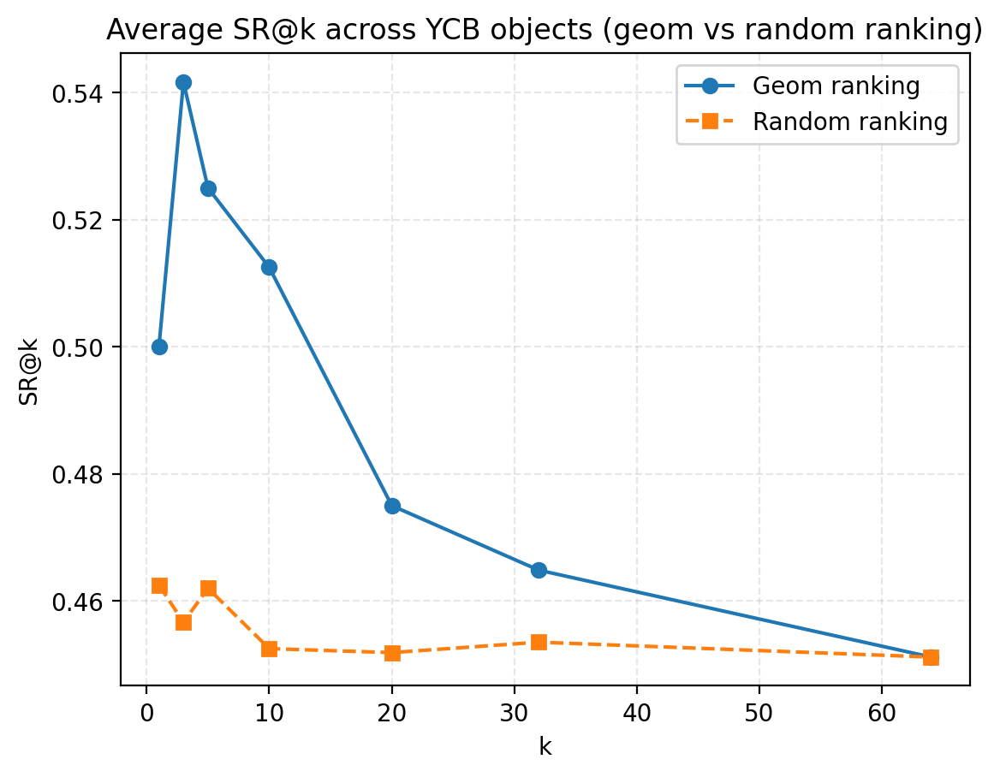
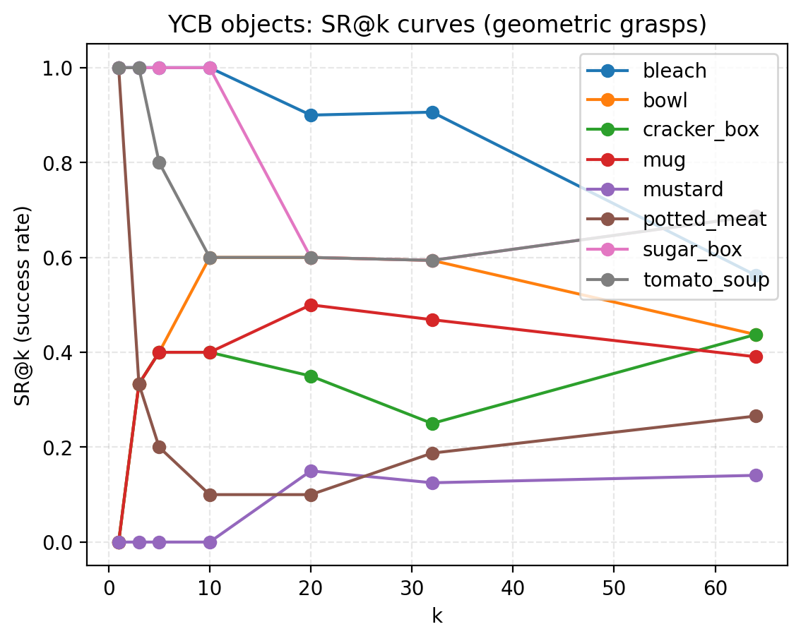

# OWG Extensions (Stage2–4): 6-DoF Grasp + Semantic PC + LG-GSN Ranker

This repository contains my MSc research extensions built on top of the OWG project (upstream).

- **Stage 2**: 6-DoF grasp generation (Open3D) + PyBullet/Panda validation + SR@k evaluation
- **Stage 3**: language-driven semantic perception → semantic point cloud alignment
- **Stage 4**: LG-GSN grasp ranking (geometry-only / multimodal variants)

Upstream OWG: https://github.com/gtziafas/OWG

## Structure
- `grasp_6dof/` — 6-DoF grasp sampler / validator / tools
- `scripts/` — dataset generation / evaluation / plotting
- `models/` — LG-GSN model definitions
- `patches/owg_patch.diff` — patch to apply on upstream OWG
- `configs/` — configs
- `media/` — key figures

## Setup
```bash
pip install -r requirements.txt

```

## Results Preview

### Ranking vs Random


### YCB SR Curves

